# Projections 3D de l’action naturelle des sous-groupes finis du groupe spécial orthogonal sur des polytopes uniformes de dimension $2n$

Démos de projections (polytopes uniformes de dimension paire) et notebook Jupyter.
**Live gallery** : https://muaadtmtm.github.io/3d-projection/

- Notebook : [`notebooks/3D_Projection.ipynb`](notebooks/3D_Projection.ipynb)
- Page portfolio : [`docs/index.md`](docs/index.md)
- Les GIF (préviews) sont dans `docs/assets/`, les MP4 dans `docs/videos/`.

---

## Gallery (cliquer sur un aperçu pour ouvrir la vidéo)

<table>
<tr>
<td align="center">
  <a href="https://muaadtmtm.github.io/3d-projection/videos/4-orthoplexe.mp4">
    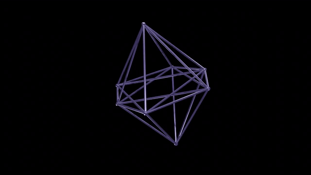
    <br/><sub><code>4-orthoplexe.mp4</code></sub>
  </a>
</td>
<td align="center">
  <a href="https://muaadtmtm.github.io/3d-projection/videos/4-simplexe.mp4">
    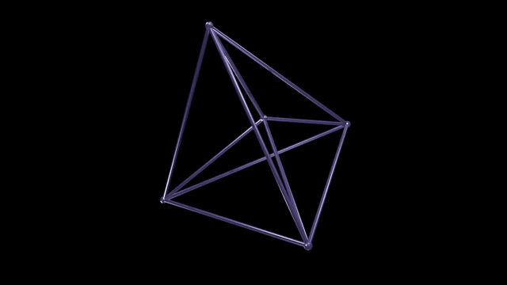
    <br/><sub><code>4-simplexe.mp4</code></sub>
  </a>
</td>
<td align="center">
  <a href="https://muaadtmtm.github.io/3d-projection/videos/6-simplexe.mp4">
    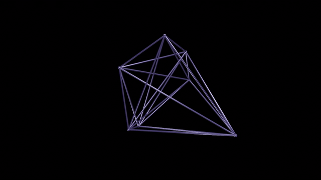
    <br/><sub><code>6-simplexe.mp4</code></sub>
  </a>
</td>
</tr>

<tr>
<td align="center">
  <a href="https://muaadtmtm.github.io/3d-projection/videos/8-demicube.mp4">
    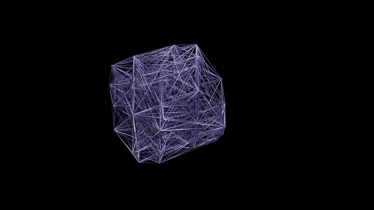
    <br/><sub><code>8-demicube.mp4</code></sub>
  </a>
</td>
<td align="center">
  <a href="https://muaadtmtm.github.io/3d-projection/videos/8-orthoplexe.mp4">
    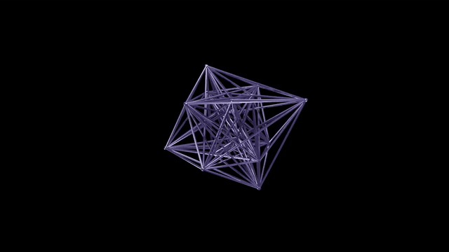
    <br/><sub><code>8-orthoplexe.mp4</code></sub>
  </a>
</td>
<td align="center">
  <a href="https://muaadtmtm.github.io/3d-projection/videos/8-simplexe.mp4">
    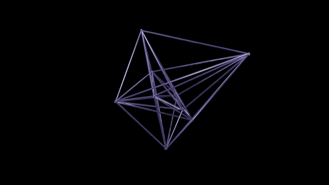
    <br/><sub><code>8-simplexe.mp4</code></sub>
  </a>
</td>
</tr>

<tr>
<td align="center">
  <a href="https://muaadtmtm.github.io/3d-projection/videos/10-simplexe.mp4">
    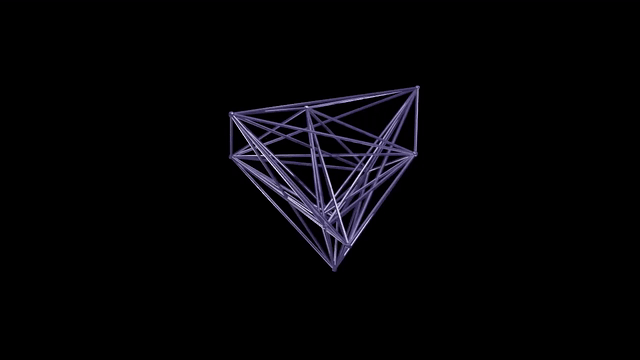
    <br/><sub><code>10-simplexe.mp4</code></sub>
  </a>
</td>
<td align="center">
  <a href="https://muaadtmtm.github.io/3d-projection/videos/24-cell.mp4">
    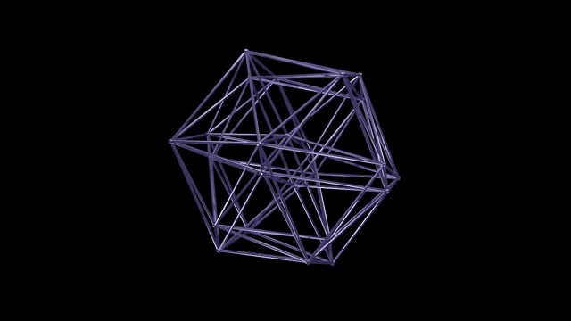
    <br/><sub><code>24-cell.mp4</code></sub>
  </a>
</td>
<td align="center">
  <a href="https://muaadtmtm.github.io/3d-projection/videos/120-cell.mp4">
    
    <br/><sub><code>120-cell.mp4</code></sub>
  </a>
</td>
</tr>

<tr>
<td align="center">
  <a href="https://muaadtmtm.github.io/3d-projection/videos/600-cell.mp4">
    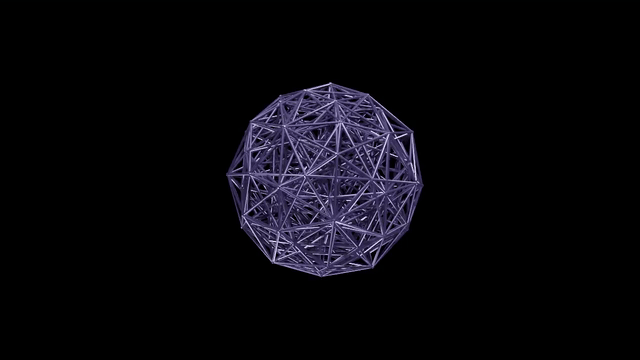
    <br/><sub><code>600-cell.mp4</code></sub>
  </a>
</td>
<td align="center">
  <a href="https://muaadtmtm.github.io/3d-projection/videos/great_grand_stellated_120-cell.mp4">
    
    <br/><sub><code>great_grand_stellated_120-cell.mp4</code></sub>
  </a>
</td>
<td align="center">
  <a href="https://muaadtmtm.github.io/3d-projection/videos/great_stellated_120-cell.mp4">
    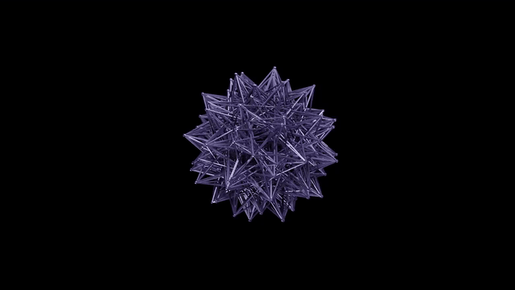
    <br/><sub><code>great_stellated_120-cell.mp4</code></sub>
  </a>
</td>
</tr>

<tr>
<td align="center">
  <a href="https://muaadtmtm.github.io/3d-projection/videos/hypercube.mp4">
    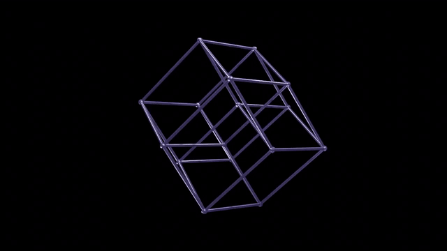
    <br/><sub><code>hypercube.mp4</code></sub>
  </a>
</td>
<td align="center">
  <a href="https://muaadtmtm.github.io/3d-projection/videos/rectified_6-cube.mp4">
    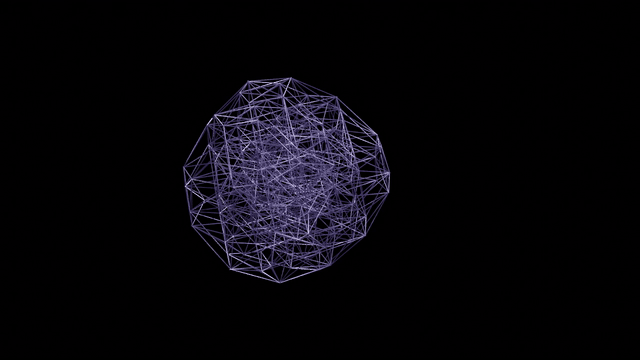
    <br/><sub><code>rectified_6-cube.mp4</code></sub>
  </a>
</td>
<td align="center">
  <a href="https://muaadtmtm.github.io/3d-projection/videos/small_stellated_120-cell.mp4">
    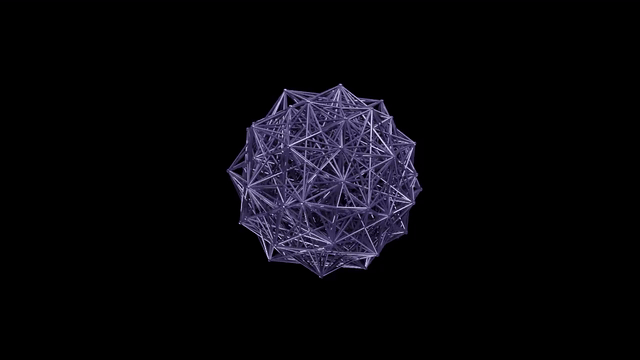
    <br/><sub><code>small_stellated_120-cell.mp4</code></sub>
  </a>
</td>
</tr>
</table>

---

## Local quickstart

```bash
# Python (optionnel si tu veux lancer un petit serveur/app)
python3 -m venv .venv
source .venv/bin/activate  # Windows: .venv\Scripts\activate
pip install -r app/python_app/requirements.txt
python app/python_app/app.py  # http://127.0.0.1:5000
